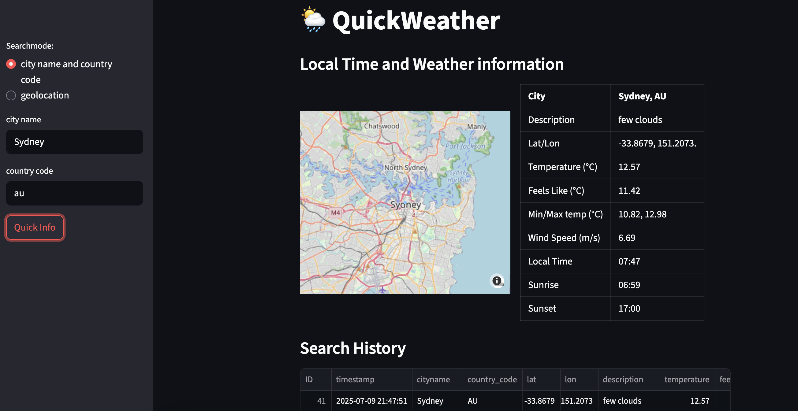

# QuickWeather

Small Streamlit app to quickly check to current local weather and time information, using the openweathermap.org API <br>

### Features
- search by 
    - city name
    - geolocation
- get 
    - current weather 
    - local time 
    - sunrise/down time.
    - area map

### App Structure
```
QuickWeather/
│
├── app.py #mainapp
├── README.md
├── requirements.txt
├── LICENSE
│
├── db/
│   └── search_results.db
│
├── modules/
    ├── __init__.py
    ├── datacollector.py
    └── dbhandler.py

```

### modules
- datacollector.py
    - class for handling API requests and sorting results
- dbhandlerpy
    - class for populating the search history sqlite db from the search results and giving pandas dataframes from the database entries for the streamlit frontend
- app.py 
    - main app, streamlit frontend

### Screenshot

